# 题目J 分布式机器学习预处理算子对比

```text
.
├── assets                            # 图片等资源
├── code                              # 代码文件
│   ├── deploy                        # 部署相关
│   │   ├── images                    # 自定义镜像
│   │   │   └── spark                 # Spark自定义镜像
│   │   ├── infra                     # 基础设施
│   │   │   ├── assets                # 相关配置资源
│   │   │   ├── data                  # 映射数据
│   │   │   └── docker-compose.yaml   # 基础设置Compose配置
│   │   ├── ray                       # Ray集群
│   │   │   └── docker-compose.yml    # Ray集群Compose配置
│   │   └── spark                     # Spark集群
│   │       ├── assets                # Spark相关配置资源（配置文件、脚本、外部JAR等）
│   │       └── docker-compose.yml    # Spark集群Compose配置
│   └── experiments                   # 实验代码
│       ├── ray                       # Ray实验代码
│       │   ├── Exp1
│       │   ├── Exp2
│       │   └── Exp3
│       └── spark                     # Spark实验代码
│           ├── Exp1
│           ├── Exp2
│           └── Exp3
└── README.md                         # 项目说明
```

组号：4

成员：51285903065 郭东旭、52295903013 朱益辉（博士）、51285903055 张京斌、51285903015 杜茗天

## 研究目的

比较Ray Data和Spark MLlib中的机器学习预处理算子。

## 研究内容

通过对比分析Ray Data与Spark MLlib在机器学习数据预处理（如标准化、归一化、特征编码等）算子上的实现机制与性能差异，探究Ray和Spark的差异。

**增加部分**：进一步分析在较大规模数据集（~12GB）下，Ray Data与Spark MLlib在多种数据预处理任务中的扩展性和资源利用效率，评估其在实际大数据处理场景中的适用性。

利用Spark的Eventlog、DAG及PrometheusServlet上报的数据，以及Ray的Dashboard、timeline及上报到Prometheus的CPU、内存利用率数据，分析两者在资源利用率、任务执行时间等方面的差异。

算子选择：

| 实验序号 | 预处理算子    |实验动机 | Spark MLlib                                                                 | Ray Data                                                                                           |
|---|---|---|---|---|
| 1        | 标准化         |全局统计量依赖| `pyspark.ml.feature.StandardScaler`                                         | `ray.data.preprocessors.StandardScaler`                                                            |
| 2        | 特征编码       |高维稀疏数据处理| `pyspark.ml.feature.CountVectorizer`                                        | `ray.data.preprocessors.CountVectorizer`                                                           |
| 3        | 分位数         |近似计算与分桶| `pyspark.sql.DataFrame.approxQuantile`, `pyspark.ml.feature.QuantileDiscretizer` | `ray.data.aggregate.ApproximateQuantile`, `ray.data.preprocessors.CustomKBinsDiscretizer`          |

## 实验

### 实验环境

#### 硬件环境

Ray/Spark集群中包含4个节点，每个节点配置为8核 CPU、32G 内存、32G SHM。

#### 软件环境

使用Docker容器化部署Spark、Ray集群与基础设施，每次实验之间重建集群，确保多次实验之间环境的一致性。

宿主机操作系统 `CentOS 7`, Linux 内核版本 `3.10.0-1160.el7.x86_64`, Docker Engine `26.1.4`, containerd `1.6.33`

Ray/Spark 集群均采用1个主节点 + 3个从节点的架构。

##### Spark 集群

容器基础镜像 `spark:4.0.1-scala2.13-java21-python3-ubuntu`

- JDK 版本： `OpenJDK 21.0.9`
- Spark 版本： `4.0.1 (git revision 29434ea766b)`
- Hadoop 版本： `3.4.1`
- Python 版本： `3.10.12`

Python依赖:

```text
pandas
numpy
scipy
scikit-learn
fsspec
```

额外包含Spark History Server 用于查看 Spark 作业执行详情。

##### Ray 集群

容器基础镜像 `rayproject/ray:2.51.1-py311-cpu`

- Ray 版本： `2.51.1`
- Python 版本： `3.11`

Python依赖:

```text
pandas
numpy
s3fs
fsspec
boto3
pyarrow
psutil
```

##### 基础设施

S3 存储 MinIO： `minio/minio:RELEASE.2025-09-07T16-13-09Z` / `minio/mc:RELEASE.2025-08-13T08-35-41Z`

存储桶信息：

- `bigdata-dataset` ：存放实验数据集
- `bigdata-ray-logs` ：存放 Ray 日志与实验结果
- `bigdata-spark-logs` ：存放 Spark Eventlog 供 Spark History Server 使用

指标收集 Prometheus： `prom/prometheus:latest`

可视化 Grafana： `grafana/grafana-oss:latest`

### 实验负载

选用数据集如下：

#### Airline on-time Performance Data

主要的数值类型数据集 `Airline on-time Performance Data` 选自 Kaggle，包含从1987年10月至2008年4月的商业航班信息，总记录数为 123534969 （1.2亿）条，数据大小约 12GB，原始数据格式为Shuffle过的CSV。数据集链接：[https://www.kaggle.com/datasets/bulter22/airline-data](https://www.kaggle.com/datasets/bulter22/airline-data)。

为了对比不同预处理算子与不同框架在不同规模数据集上的表现，同时为了**保持数据集原始的分布特性**，我们从该数据集中按`Year`字段进行了分层采样，构建了1% ~ 15%，及5% ~ 95%约25种不同规模的数据子集，每个子集保存到`Parquet`格式，并上传至MinIO存储桶`bigdata-dataset`中，供实验使用。

数据中包含多个数值型特征如日期`Year`、`Month`、`DayofMonth`和具有长尾分布的`ArrTime` (到达时间)等，适合用于测试标准化和分位数等预处理算子。

#### MiniPile

为了测试特征编码算子，我们选用了文本数据集 `MiniPile`，该数据集是从大型文本语料库`The Pile`中抽取的一个小型子集，包含约3.1GB的纯文本数据，适合用于测试文本特征编码的效果。数据集链接：[https://huggingface.co/datasets/JeanKaddour/minipile](https://huggingface.co/datasets/JeanKaddour/minipile)。同样将其上传至MinIO存储桶`bigdata-dataset`中，供实验使用。

### 实验步骤

#### 环境搭建

使用Docker Compose搭建基础设施及Ray/Spark集群环境。

使用MinIO作为S3存储，Prometheus用于监控集群指标。
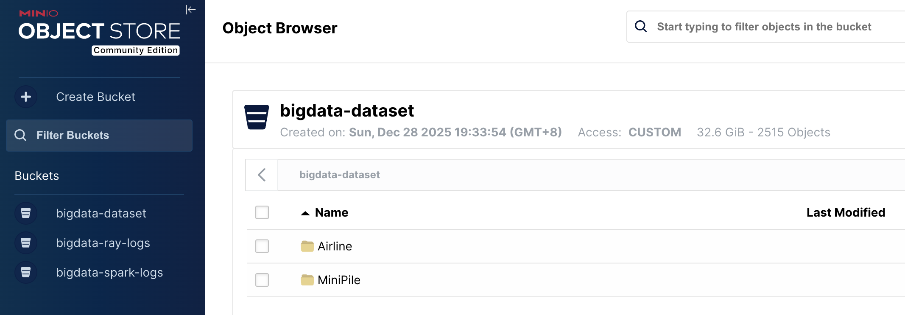

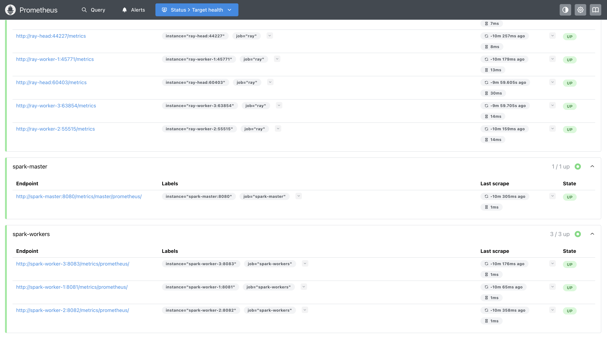

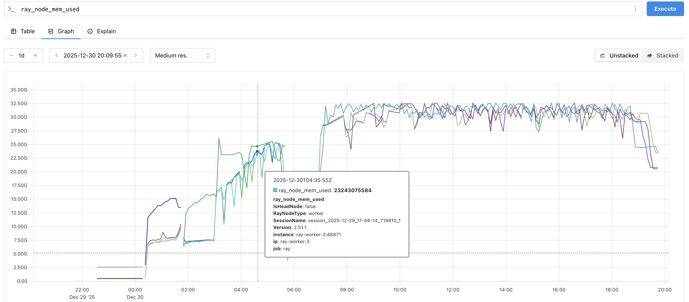

搭建Spark集群，可以看到作业执行的Timeline和DAG信息，并配置Spark History Server以便查看作业执行详情。

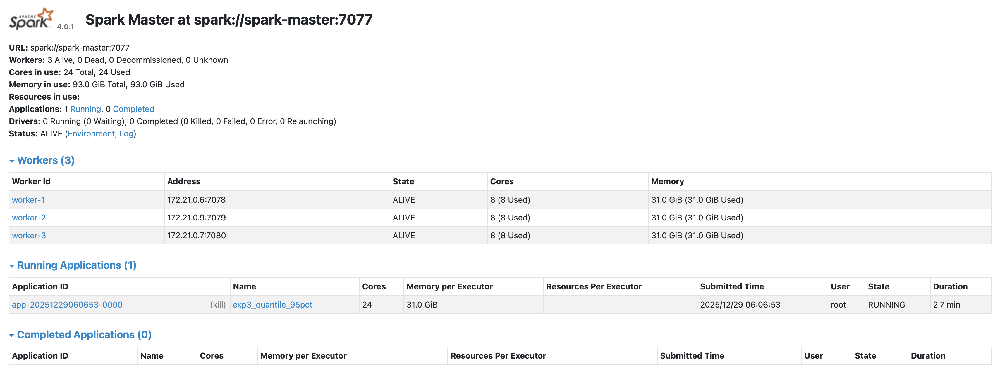

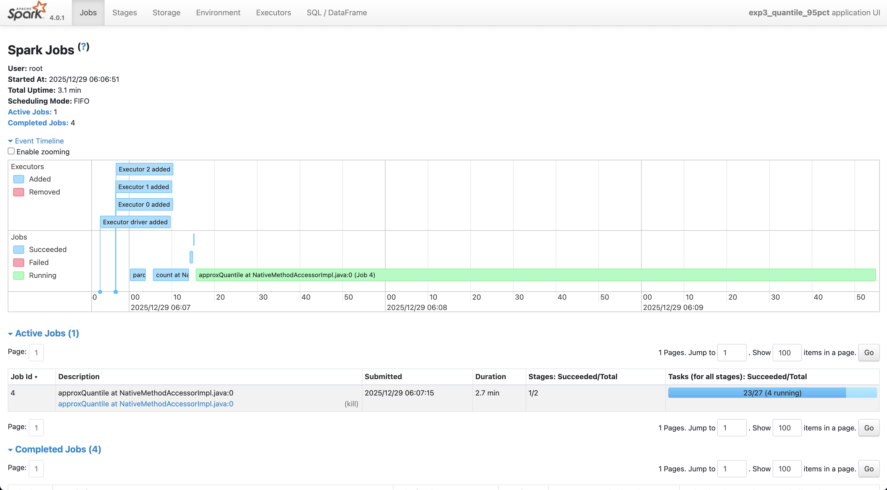

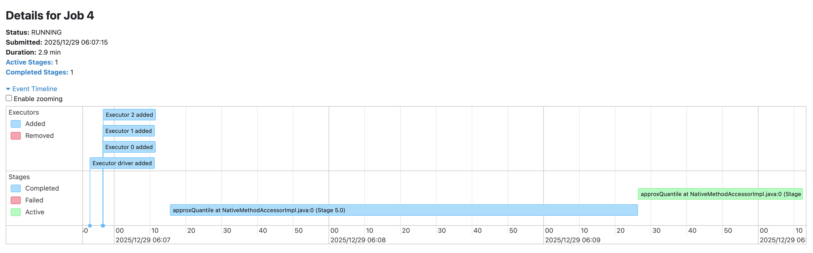

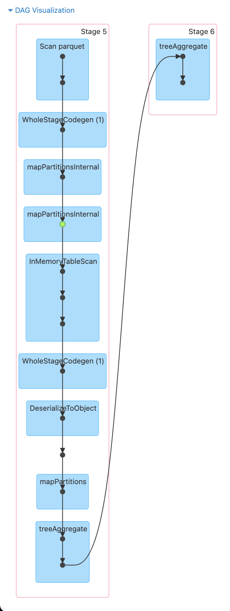


搭建Ray集群，可以通过Ray Dashboard查看集群状态和任务执行情况。

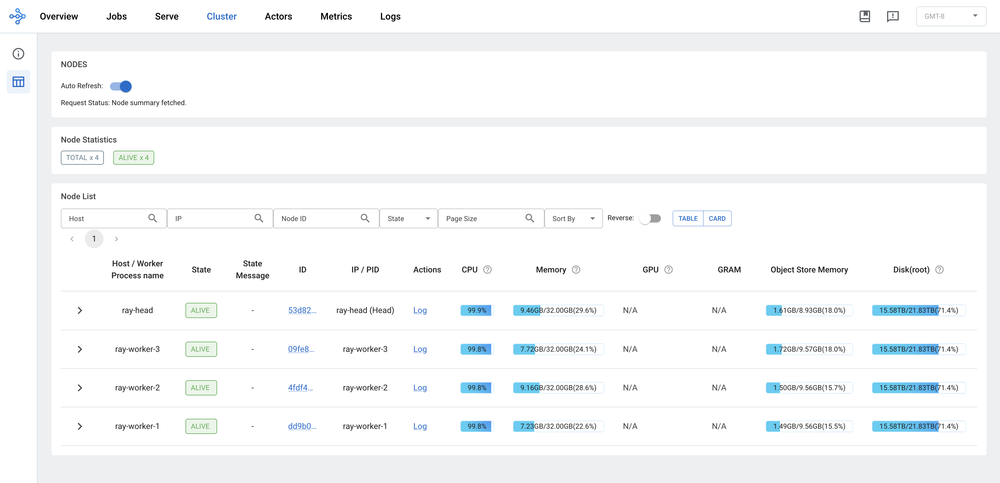

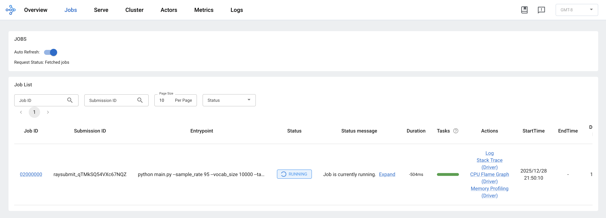

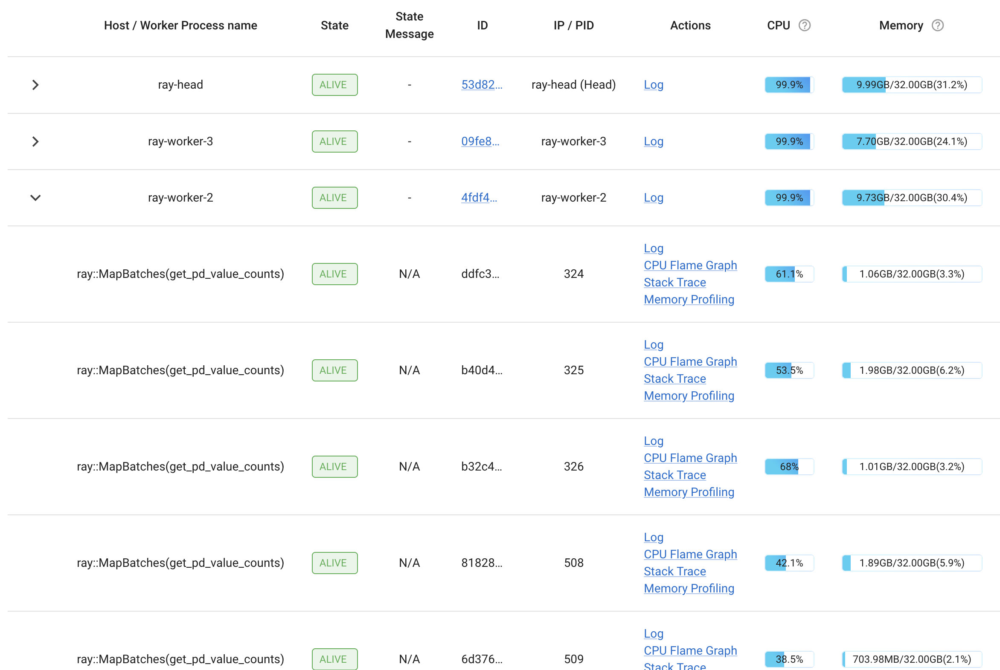

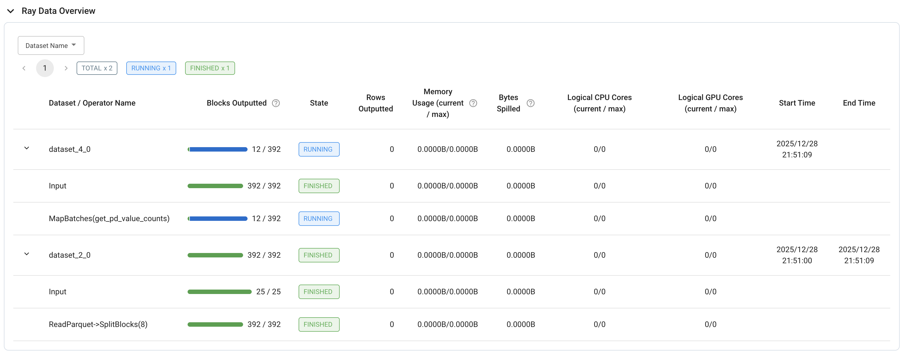

#### 数据抽样

使用Spark对`Airline on-time Performance Data`数据集按`Year`字段进行分层采样，生成不同规模的数据子集，并保存为Parquet格式上传至MinIO。

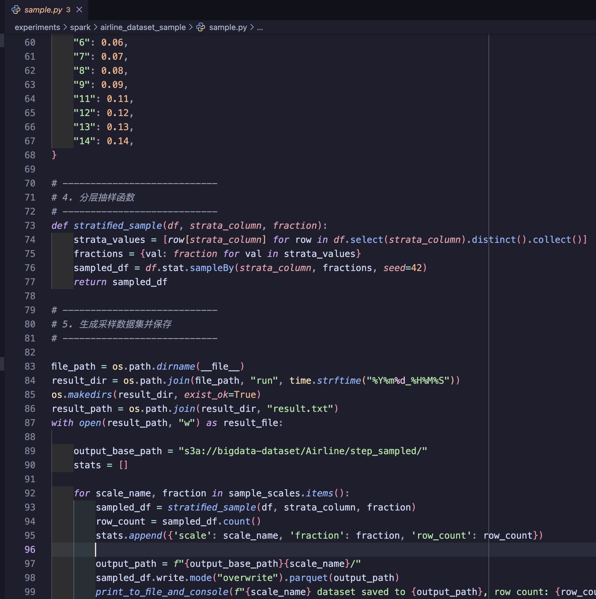

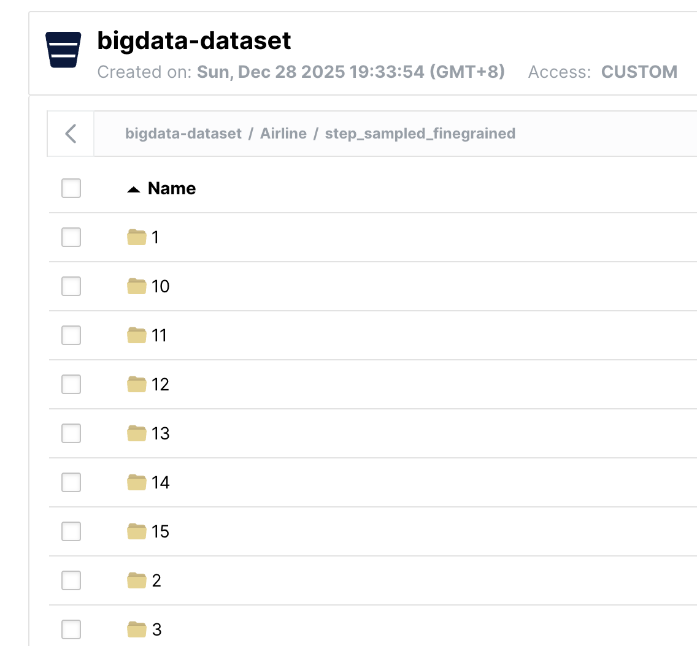

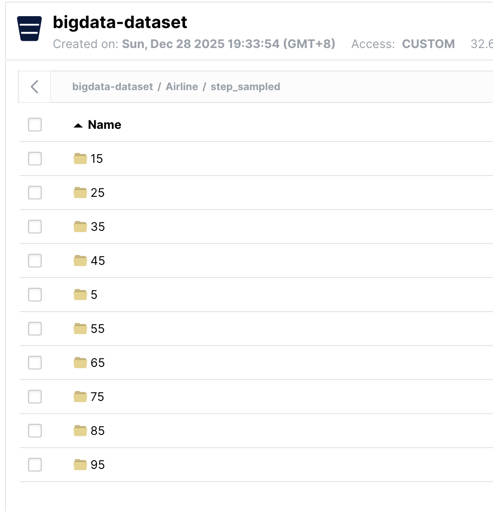

#### 实验一

实验一的设计基于我们对Spark MLlib和Ray Data的调研，选择了标准化这一常用的预处理算子进行对比。标准化在机器学习中广泛应用于数据预处理阶段，有助于提升模型的收敛速度和性能。通过对比两者在不同规模数据集上的表现，我们可以深入了解它们在处理大规模数据时的效率和资源利用情况。

**标准化算子的实现依赖于对整个数据集的全局统计量（均值和标准差）的计算，这使其成为评估分布式计算框架在处理大规模数据时性能的关键指标。**

实验一中对数据进行了标准化处理，分别使用Spark MLlib的`pyspark.ml.feature.StandardScaler`和Ray Data的`ray.data.preprocessors.StandardScaler`对不同规模的Airline数据集进行了标准化处理，并记录了每次实验的性能指标。

每次提交实验任务时，均通过Prometheus收集CPU和内存利用率数据，通过Spark Eventlog和Ray Dashboard收集任务执行时间和资源使用情况。Spark任务使用PySpark编写，进入Spark master容器中使用`spark-submit`提交；Ray任务使用Ray Python API编写，进入Ray head节点容器中使用`ray job submit`提交。提交任务后通过`tee`命令将标准输出和错误输出重定向到日志文件中，便于后续分析。

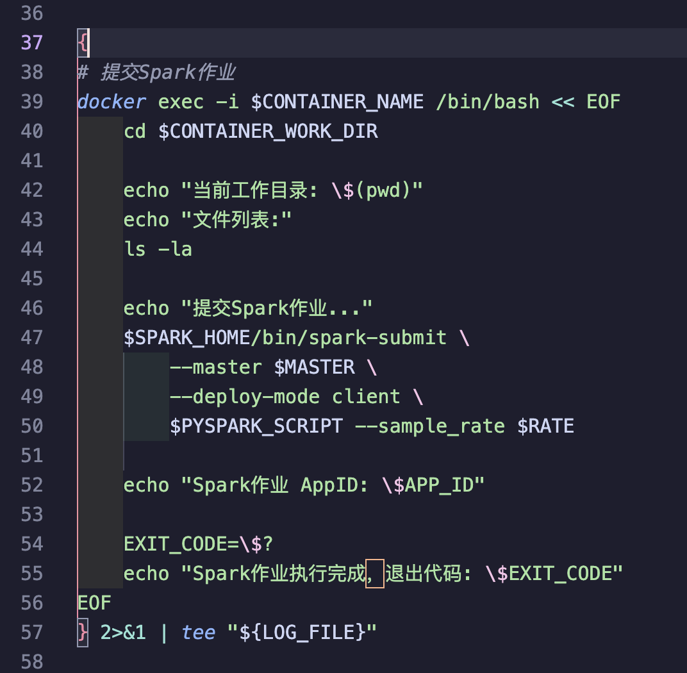

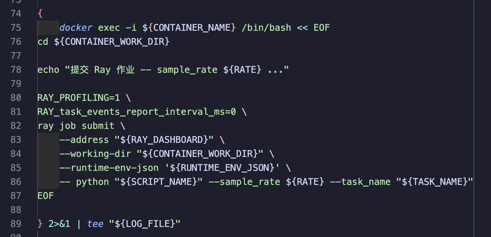

收集到的数据除写入本地路径外，会额外写入MinIO存储桶`bigdata-spark-logs`和`bigdata-ray-logs`中，便于后续实验结果的整理和分析。

下面为实验一中收集到的部分性能数据示例：


#### 实验二

实验二选择了特征编码中的计数向量化（Count Vectorization）作为对比对象。计数向量化是文本数据处理中常用的技术，能够将文本转换为数值特征，便于后续的机器学习任务。

**通过对比Spark MLlib和Ray Data在处理文本数据时的性能，我们可以评估它们在高维稀疏数据处理方面的能力**。

在实验二中，我们使用MiniPile数据集，分别采用Spark MLlib的`pyspark.ml.feature.CountVectorizer`和Ray Data的`ray.data.preprocessors.CountVectorizer`对文本数据进行了特征编码处理，并记录了每次实验的性能指标。

#### 实验三

实验三选择了分位数计算和分桶（Quantile Discretization）作为对比对象。分位数计算在数据分析和预处理中具有重要意义，能够帮助理解数据的分布特性，而分桶则是将连续变量转换为离散类别的常用方法。

**通过对比Spark MLlib和Ray Data在近似分位数计算和分桶处理方面的性能，我们可以评估它们在处理大规模数据时的效率和准确性**。

在实验三中，我们使用Airline数据集，分别采用Spark MLlib的`pyspark.sql.DataFrame.approxQuantile`和`pyspark.ml.feature.QuantileDiscretizer`，以及Ray Data的`ray.data.aggregate.ApproximateQuantile`和`ray.data.preprocessors.CustomKBinsDiscretizer`对数据进行了分位数计算和分桶处理，并记录了每次实验的性能指标。

### 实验结果与分析

#### 实验1 Spark与Ray在标准化任务中的性能对比分析

##### 1.1 不同数据规模下的标准化算子性能对比

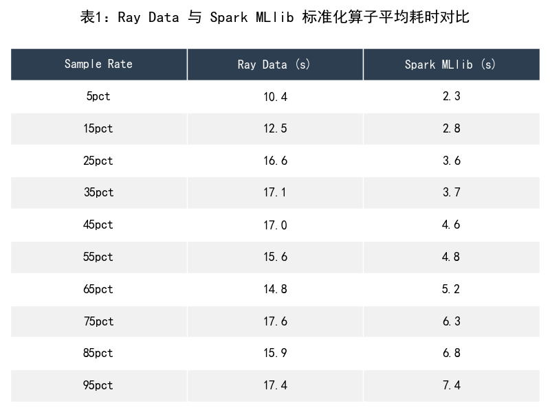

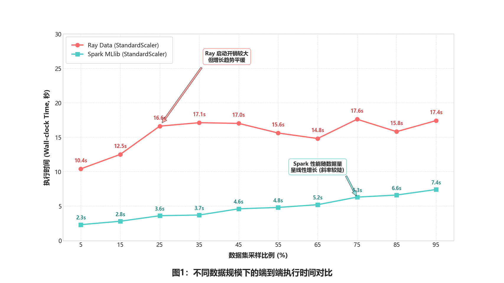

对比分析:

1. 总体性能表现

- **Spark MLlib 占据绝对优势**：在标准化（StandardScaler）算子上，Spark 的执行速度全程快于 Ray Data，平均提升 **2-4 倍**。
- **数据实证**：在数据集采样比例95%的数据量下，Spark 耗时 **7.4s**，Ray 耗时 **17.4s**，证明Spark的性能远快于Ray Data。

2. 增长趋势分析

- **Spark (线性增长)**：呈现标准的线性扩展特征，计算时间随数据量增加而均匀上升，且斜率较陡。
- **Ray (高启动、低斜率)**：
  - **高启动开销**：5%比例的数据集时即耗时 **~10.4s**，存在显著的系统初始化成本。
  - **平缓趋势**：随着数据量增加，Ray的耗时波动较小，表明其处理增量数据的边际成本较低。

3. 对比结论

- 对于**轻量级数值计算**任务，Spark 的 **JVM 执行引擎优化** 效率高于 Ray 的 Python 交互模式。

##### 1.2 Ray 集群 CPU 利用率

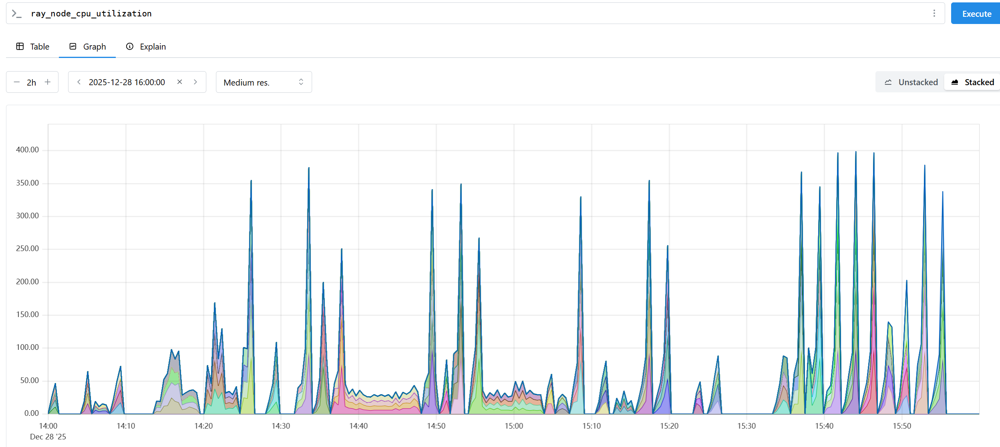

图表解读：

1. 脉冲式特征：任务启动即打满 CPU，计算结束瞬间释放无 I/O 等待造成的拖尾，资源零浪费。

2. 极高计算密度：峰值接近 400 (4节点满载)，说明流水线机制使 CPU 始终处于饱和计算状态。

3. 线性扩展性：右侧(15:40后)的高频波峰对应大数据量，计算强度维持高位，无性能衰减。

##### 1.3 Ray 组件物理内存

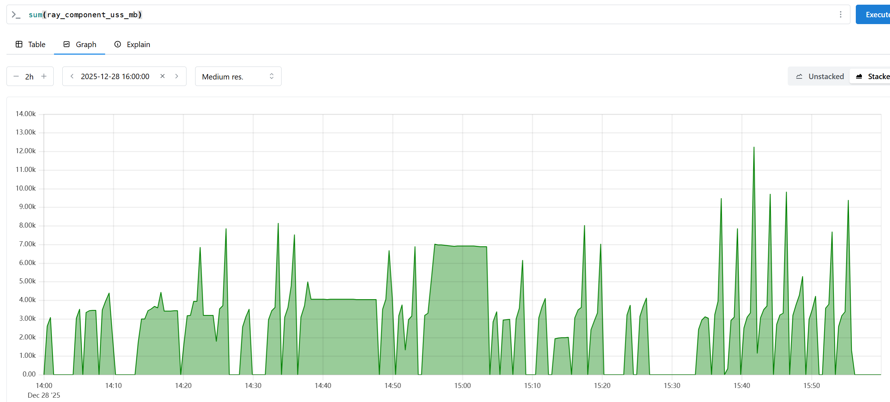

图表解读：

1. 基线极低: 任务间隙内存迅速归零，无 JVM 堆积。

2. 零拷贝机制: 绿色区块仅代表 Python 进程的临时开销，大数据存储在 Object Store (共享内存) 中，不在此图中显示。

3. 瞬时释放: 任务结束即释放资源，适合高并发场景。

##### 1.4 Ray进程 CPU 累计时间

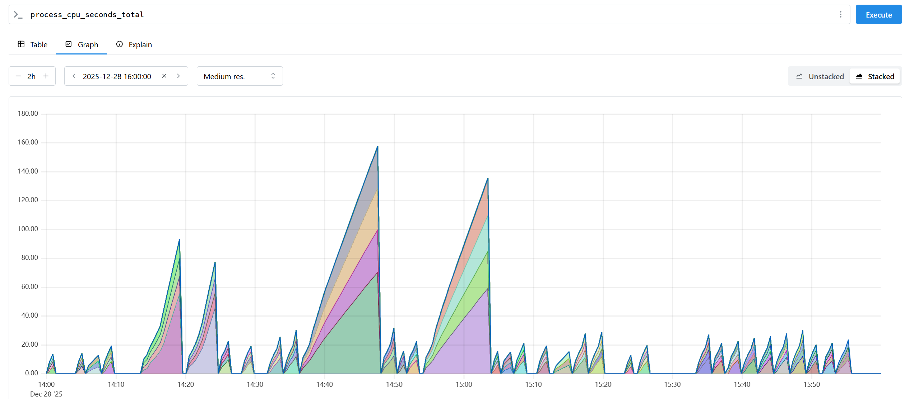

图表解读：

1. 锯齿波形 (Sawtooth): 线性上升代表任务正在积累计算量，垂直掉落代表任务结束，Worker 进程重置或销毁。

2. 隔离性: 每次实验重置集群(Reset Cluster)，确保无状态残留，对应脚本中的 reset_ray_cluster.sh。

3. 计算强度: 斜率越陡，代表 CPU 占用越满 (满载运行)。

##### 1.5 Spark MLlib 在 95% 数据规模下的任务执行时间轴与开销分析


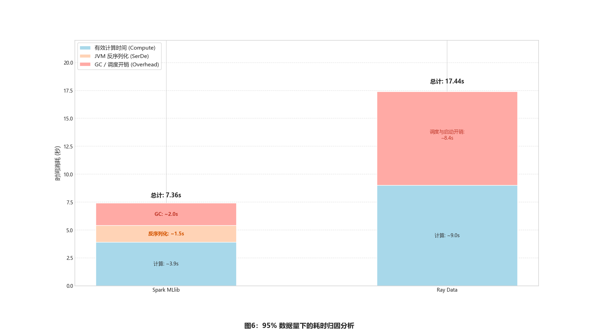

对比分析
- 处理小数据量时，系统未达瓶颈，会掩盖**内存管理和序列化**的真实成本，因此选择95% 数据规模。在**极限负载**下，更能体现**分布式框架**在 **OOM 边缘的稳定性与资源调度能力**。
- Spark具有**低延迟、高内耗**特点，虽执行速度快，但有47%的时间消耗在**非计算环节**（GC和反序列化）。
- Ray具有**高延迟、零内耗**的特点，调度和启动开销大，但得益于 **Zero-Copy** 机制，无GC和反序列化成本，有效计算占比高

#### 实验2 Spark与Ray在特征编码任务中的性能对比分析

本研究针对分布式环境下的高维稀疏特征提取（CountVectorizer）进行了对比实验。实验结果显示，Apache Spark 在处理此类算子时表现出显著的稳定性和高效性。在相同的 5% 数据集负载下，Spark 处理 200,000 维特征仅需 41 秒。与之形成鲜明对比的是，Ray Data 的执行延迟随特征维度的增加急剧恶化，在 100,000 维度以上的场景中，其执行时长超过 1 小时（4,199s），性能衰减超过两个数量级。Ray 在全局字典构建阶段，随着特征维度增加，其分布式对象存储（Object Store）在处理大型元数据对象时产生了严重的序列化瓶颈，Apache Spark 凭借其成熟的 BSP（Bulk Synchronous Parallel） 模型与深度优化的稀疏向量存储，在维度扩展与容量扩展上均展现了卓越的稳定性。相比之下，基于 Task 异步调度 的 Ray Data，在构建全局特征词典这一特定环节，受限于分布式对象存储的传输开销，在万维以上规模时出现了严重的性能退化。

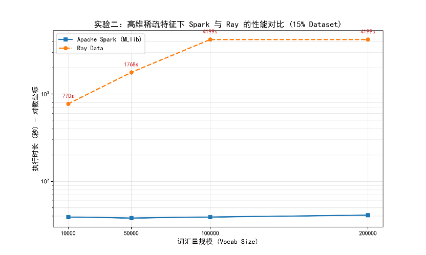


上图第一张为显示了ray与spark的对比，由于ray无法运行数据不足，无明显趋势；第二张图为spark单独展示。


##### 2.1 底层架构差异分析

全局同步与字典构建机制：CountVectorizer 的核心挑战在于需要扫描全量数据以构建全局一致的词项字典。Spark 采用了成熟的 BSP模型 ，通过明确的全局屏障和优化的Shuffle算子进行字典聚合，能够有效规避大规模数据同步时的随机通信开销。

细粒度调度与对象传输成本：Ray 采用基于 Task 的并行模型，其优势在于流水线处理（Pipelining）。然而，在处理 CountVectorizer 这种需要强一致性全局状态的任务时，Ray 的分布式对象存储面临巨大的序列化压力。 随着词汇量（即对象大小）增加，跨节点传输大尺寸字典的开销成为了系统的主要瓶颈。

稀疏数据结构优化：Spark MLlib 针对 JVM 环境进行了深度的稀疏向量内存布局优化，显著降低了 Shuffle 过程中的数据足迹。相比之下，Ray Data 在高维度稀疏特征的内存管理上尚不具备同等程度的针对性优化，导致其在高维场景下更易触发磁盘溢写。

#### 实验3 Spark与Ray在分位数离散化任务中的性能对比分析

首先是对Ray和Spark的cpu利用率进行比较，收集到的数据如下所示：


Spark 的cpu资源利用模式：短时间内集中使用所有分配的资源（8核），然后完全释放。这可能导致在作业运行时 CPU 利用率确实很高，但平均利用率很低。


Ray 的模式是资源始终被占用，系统不断处理各种细粒度任务，导致 CPU 利用率曲线持续波动。

接下来，本实验旨在深入比较Apache Spark与Ray在执行大规模数据分位数离散化（Quantile Discretization）任务时的性能表现，重点关注精度（误差）、单算子处理延迟以及端到端流水线总耗时三个核心维度。但由于Spark在采样率超过6%时出现OOM，仅收集到6组Spark数据。分析如下：

首先是Spark的OOM原因分析：这很可能是因为在高精度要求下，Spark需要为每个分位点维护一个庞大的近似直方图或排序结构。当数据量增大时，这些中间数据结构的内存占用呈非线性增长，最终超出Executor的堆内存上限。说明Spark在处理高精度、大数据量分位数计算时的固有瓶颈。

##### 3.1 分位数误差对比分析

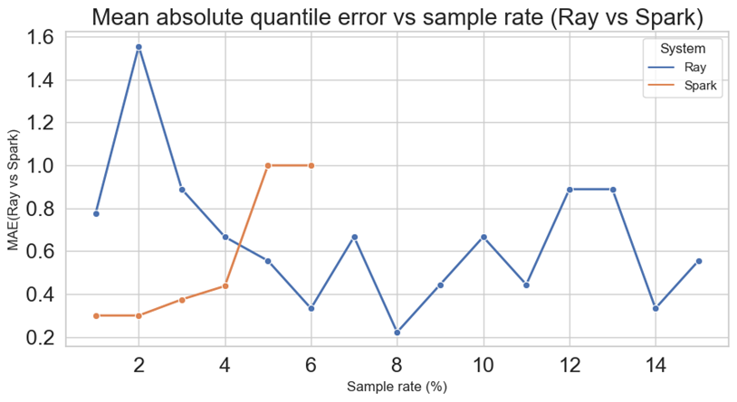

Ray: 整体误差（MAE）稳定在0.8至1.6之间，平均值约在1.0左右。其误差曲线随采样率增加呈现波动，但无明显的上升或下降趋势，表明其算法对数据量的变化不敏感，具有良好的稳定性。

Spark: 误差表现相对不稳定。在低采样率（2%-4%）时误差极低（<0.4），但随着采样率提升至5%以上，误差急剧上升并稳定在1.0左右。

##### 3.2 单个离散化算子处理时间

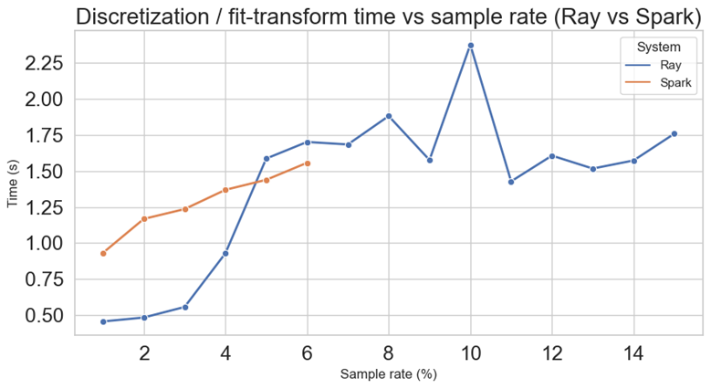

Ray: 处理时间随采样率增加而显著上升，在采样率约为6%时达到峰值（约1.75s），之后趋于稳定。在10%采样率处出现一个异常（>2.2s），这可能是由于系统资源竞争等其它因素导致。
Spark: 处理时间整体低于Ray，且增长趋势更为平缓。即使在最小的采样率（2%）下，Spark的处理延迟也普遍高于Ray（约0.9s vs 0.4s）。在采样率6%时，Spark的耗时约为1.55s。

Ray的延迟曲线显示其在中等数据量时（6%）达到性能拐点，此后处理时间稳定，说明其内部机制（如Actor调度、对象存储）在数据量达到一定规模后能够有效利用资源。10%处的尖峰属于偶发性性能抖动，不影响其整体稳定性。

对比之下，Spark在单算子层面展现出更低的延迟，这得益于其高度优化的内存管理和执行引擎（Tungsten）。然而，这种优势在端到端的流水线中并未体现出来，表明其优势被其他阶段（如数据加载、Shuffle）所抵消。

总之，在数据量较小时，Ray的单算子延迟显著优于Spark；随着数据量增大，Spark的延迟优势逐渐显现，但仍受限于其内存瓶颈。

##### 3.3 端到端流水线总耗时对比分析

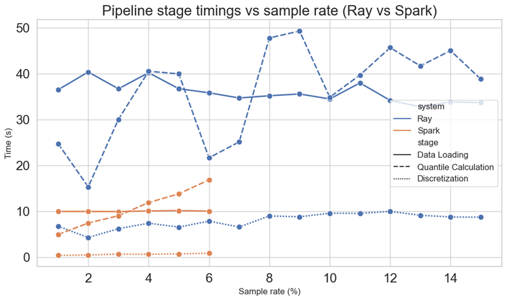

在整个包含“数据加载”、“分位数计算”和“离散化”三个阶段的流水线中，Spark的总耗时始终短于Ray。例如，在6%采样率下，Spark总耗时约17s，而Ray约35s。

1) 数据加载 (Data Loading): Spark在此阶段耗时显著低于Ray，尤其是在高采样率下（如8%，Spark约10s，Ray约48s）。这表明Spark在数据I/O和分区管理方面效率更高。

2) 分位数计算 (Quantile Calculation): Ray在此阶段耗时明显长于Spark，且随采样率增加而增长，这是其总耗时较长的主要原因。

3) 离散化 (Discretization): 此阶段耗时与3.2节的单算子时间趋势一致，Ray在小数据量时更快，但在中等数据量后慢于Spark。

Spark在端到端吞吐量上胜出，但其成功依赖于数据规模不能过大；Ray在计算精度和内存稳定性上胜出，但其端到端延迟较高。选择哪个框架取决于具体应用场景的需求：若追求快速完成小到中等规模的任务，Spark是更好的选择；若任务规模巨大且对内存稳定性和计算一致性要求极高，则Ray是更可靠的选择。

### 结论

在实验1中，Ray具备更先进的内存管理架构，但由于其高启动成本的限制，在轻量级计算中其执行性能低于基于JVM机制的Spark。从性能维度上，Spark MLlib 凭借成熟的 JVM 执行引擎 ，在处理简单的数值计算时，能够将指令优化到极致。虽然架构较旧，但在标准化这种低计算负载任务上，其执行速度依然大幅领先于 Ray。从机制维度上，实验1揭示了 Spark 的 JVM 机制性瓶颈。 而Ray通过 Zero-Copy（零拷贝） 和 Pipeline（流水线） 机制，彻底消除了这些内耗，实现了计算资源的饱和利用。从扩展维度上，启动门槛高，但处理增量数据的边际成本极低。这表示数据规模越大、计算逻辑越复杂，Ray 的架构优势将越明显；而在传统中小规模 ETL 场景下，Spark 依然更具优势。

实验2显示，针对题目所涉及的预处理算子性能对比，Apache Spark 在计算密集且需全局同步的高维特征工程任务中更具优势。尽管Ray在实时流处理和流水线计算中具备潜力 ，但在处理传统大规模、高维度的批处理机器学习预处理任务时，其架构设计的细粒度特性在全局一致性维护上付出了昂贵的性能代价。

在实验3中，可以发现，Spark 在采样率超过 6% 时因内存溢出（OOM）而失败，暴露出其在高精度分位数计算中对内存的压力比较大。而Ray对内存的鲁棒性和可扩展性更好。在精度上，Ray 的分位数误差（MAE）稳定在 0.8–1.6 之间，对采样率变化不敏感，表现出良好的算法一致性；而 Spark在低采样率下误差极低。
单算子层面，小数据量下 Ray 延迟更低，但中等数据量后 Spark 反超。在端到端流水线中，Spark 总耗时始终低于 Ray，主要得益于其高效的数据加载与 I/O 优化。
