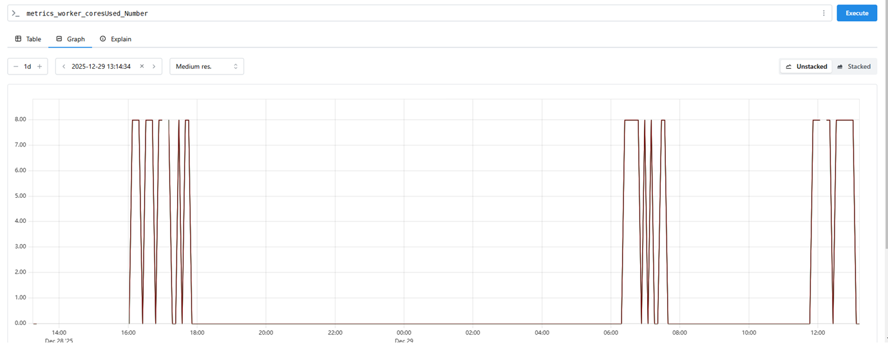
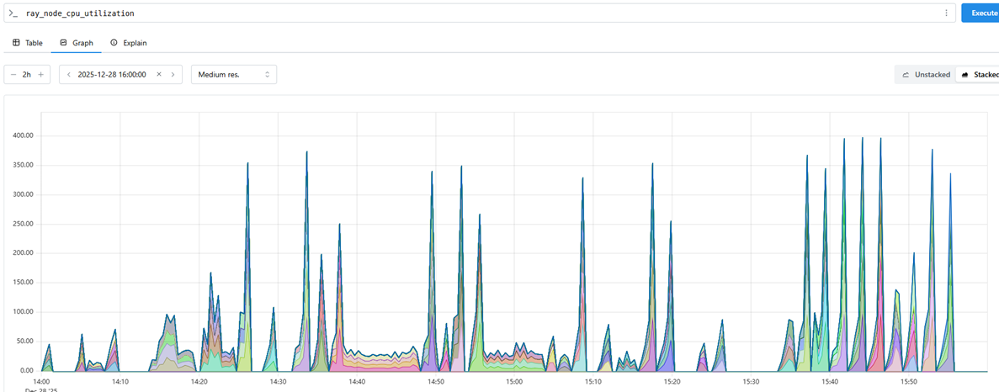

# 作业提交模板

```
.
├── code/                   # 所有实验代码
└── README.md               # 项目核心文档
```

## 研究目的
题目中已给出。

## 研究内容
题目中已给出，可在题目中已经给出的内容基础上增加研究内容，**如有增加，请明确标注增加的部分**。

## 实验

### 实验环境
* 硬件：集群配置，包括节点数 **(>=3)**、CPU 核数、内存大小、网络带宽、存储类型（SSD / HDD）等。

* 软件：操作系统、JDK 版本、各框架版本等。

### 实验负载
详细描述使用的数据集和工作负载。

### 实验步骤
列出执行实验的关键步骤，并对关键步骤进行截图，如 MapReduce / Spark / Flink 部署成功后的进程信息、作业执行成功的信息等，**截图能够通过显示用户账号等个性化信息佐证实验的真实性**。

### 实验结果与分析

### 实验结果与分析

#### 实验3 Spark与Ray在分位数离散化任务中的性能对比分析

首先是对Ray和Spark的cpu利用率进行比较，收集到的数据如下所示：



Spark 的cpu资源利用模式：短时间内集中使用所有分配的资源（8核），然后完全释放。这可能导致在作业运行时 CPU 利用率确实很高，但平均利用率很低。



Ray 的模式是资源始终被占用，系统不断处理各种细粒度任务，导致 CPU 利用率曲线持续波动。

接下来，本实验旨在深入比较Apache Spark与Ray在执行大规模数据分位数离散化（Quantile Discretization）任务时的性能表现，重点关注精度（误差）、单算子处理延迟以及端到端流水线总耗时三个核心维度。但由于Spark在采样率超过6%时出现OOM，仅收集到6组Spark数据。分析如下：

首先是Spark的OOM原因分析：这很可能是因为在高精度要求下，Spark需要为每个分位点维护一个庞大的近似直方图或排序结构。当数据量增大时，这些中间数据结构的内存占用呈非线性增长，最终超出Executor的堆内存上限。说明Spark在处理高精度、大数据量分位数计算时的固有瓶颈。
##### 3.1 分位数误差对比分析


Ray: 整体误差（MAE）稳定在0.8至1.6之间，平均值约在1.0左右。其误差曲线随采样率增加呈现波动，但无明显的上升或下降趋势，表明其算法对数据量的变化不敏感，具有良好的稳定性。

Spark: 误差表现相对不稳定。在低采样率（2%-4%）时误差极低（<0.4），但随着采样率提升至5%以上，误差急剧上升并稳定在1.0左右。


##### 3.2 单个离散化算子处理时间


Ray: 处理时间随采样率增加而显著上升，在采样率约为6%时达到峰值（约1.75s），之后趋于稳定。在10%采样率处出现一个异常（>2.2s），这可能是由于系统资源竞争等其它因素导致。
Spark: 处理时间整体低于Ray，且增长趋势更为平缓。即使在最小的采样率（2%）下，Spark的处理延迟也普遍高于Ray（约0.9s vs 0.4s）。在采样率6%时，Spark的耗时约为1.55s。

Ray的延迟曲线显示其在中等数据量时（6%）达到性能拐点，此后处理时间稳定，说明其内部机制（如Actor调度、对象存储）在数据量达到一定规模后能够有效利用资源。10%处的尖峰属于偶发性性能抖动，不影响其整体稳定性。

对比之下，Spark在单算子层面展现出更低的延迟，这得益于其高度优化的内存管理和执行引擎（Tungsten）。然而，这种优势在端到端的流水线中并未体现出来，表明其优势被其他阶段（如数据加载、Shuffle）所抵消。

总之，在数据量较小时，Ray的单算子延迟显著优于Spark；随着数据量增大，Spark的延迟优势逐渐显现，但仍受限于其内存瓶颈。

##### 3.3 端到端流水线总耗时对比分析


在整个包含“数据加载”、“分位数计算”和“离散化”三个阶段的流水线中，Spark的总耗时始终短于Ray。例如，在6%采样率下，Spark总耗时约17s，而Ray约35s。

1) 数据加载 (Data Loading): Spark在此阶段耗时显著低于Ray，尤其是在高采样率下（如8%，Spark约10s，Ray约48s）。这表明Spark在数据I/O和分区管理方面效率更高。

2) 分位数计算 (Quantile Calculation): Ray在此阶段耗时明显长于Spark，且随采样率增加而增长，这是其总耗时较长的主要原因。

3) 离散化 (Discretization): 此阶段耗时与3.2节的单算子时间趋势一致，Ray在小数据量时更快，但在中等数据量后慢于Spark。

Spark在端到端吞吐量上胜出，但其成功依赖于数据规模不能过大；Ray在计算精度和内存稳定性上胜出，但其端到端延迟较高。选择哪个框架取决于具体应用场景的需求：若追求快速完成小到中等规模的任务，Spark是更好的选择；若任务规模巨大且对内存稳定性和计算一致性要求极高，则Ray是更可靠的选择。

### 结论
在实验3中，可以发现，Spark 在采样率超过 6% 时因内存溢出（OOM）而失败，暴露出其在高精度分位数计算中对内存的压力比较大。而Ray对内存的鲁棒性和可扩展性更好。在精度上，Ray 的分位数误差（MAE）稳定在 0.8–1.6 之间，对采样率变化不敏感，表现出良好的算法一致性；而 Spark在低采样率下误差极低。
单算子层面，小数据量下 Ray 延迟更低，但中等数据量后 Spark 反超。在端到端流水线中，Spark 总耗时始终低于 Ray，主要得益于其高效的数据加载与 I/O 优化。
